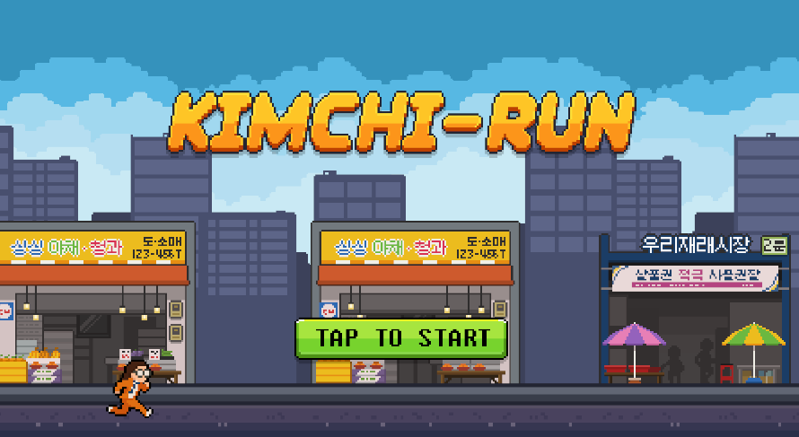

## 프로젝트 설명

Unity Korea에서 주관한 Unity6 Challenge 프로젝트입니다. 
플레이어가 골든 김치를 찾기위해 도시를 찾아 다니는 Kimch-Run이란 제목의 러닝 액션 게임 입니다.

개발 기간 : 2025.01.16 ~

장르 : 러닝 액션

조작키 : Spacebar

게임 배포 사이트 : [Kimch-Run Challenge](https://play.unity.com/en/games/d25d79e1-c526-4fe5-9734-48bffdedf62f/kimch-run-challenge)

## 프로젝트 목표

C#, Unity의 기초를 다시 공부해보면서 감각을 되살려 재밌게 개발하는 것을 목표로 하였습니다.

### 구현 기능

- Rigidbody를 이용한 점프 기능 구현
- 배경 및 적(Enemy) 오브젝트 Scroll 기능 구현
- 적(Enemy) 및 아이템 생성, 삭제 기능 구현
- stage 변환시 플레이 배경 변화 기능 구현
- particle System을 이용한 플레이어 무적(Invincible) 효과 구현

### 추후 구현할 기능

- 오브젝트 풀링 기법 적용
- stage 변환시 Enemy 추가 및 변환 효과 적용(fade in, fade out 예정)
- DB를 이용한 사용자 데이터 저장
- 아이템 기능 추가 및 Enemy 기능 추가 (팩토리 패턴 적용 고민)
